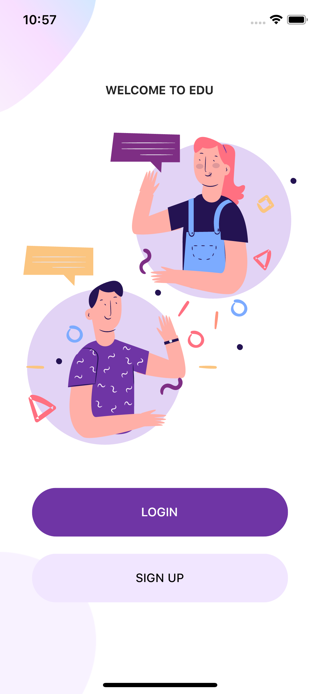

# Welcome page, Login Page and Sign up page - Flutter UI

[Watch it on YouTube](https://youtu.be/ExKYjqgswJg)

[B 站](https://www.bilibili.com/video/BV1g64y1f7t9?t=48)

# flutter_auth

A new Flutter project.

## Getting Started

This project is a starting point for a Flutter application.

A few resources to get you started if this is your first Flutter project:

- [Lab: Write your first Flutter app](https://flutter.dev/docs/get-started/codelab)
- [Cookbook: Useful Flutter samples](https://flutter.dev/docs/cookbook)

For help getting started with Flutter, view our
[online documentation](https://flutter.dev/docs), which offers tutorials,
samples, guidance on mobile development, and a full API reference.

## Packages we are using:

- flutter_svg: [link](https://pub.dev/packages/flutter_svg)

# Flutter Auth UI





# vscode 配置

```json
"dart.debugExternalLibraries": true,
"dart.debugSdkLibraries": true,
"dart.enableCompletionCommitCharacters": true,
"dart.flutterHotRestartOnSave": true,
"dart.lineLength": 120,
"dart.previewFlutterUiGuides": true,
"dart.triggerSignatureHelpAutomatically": true
```
